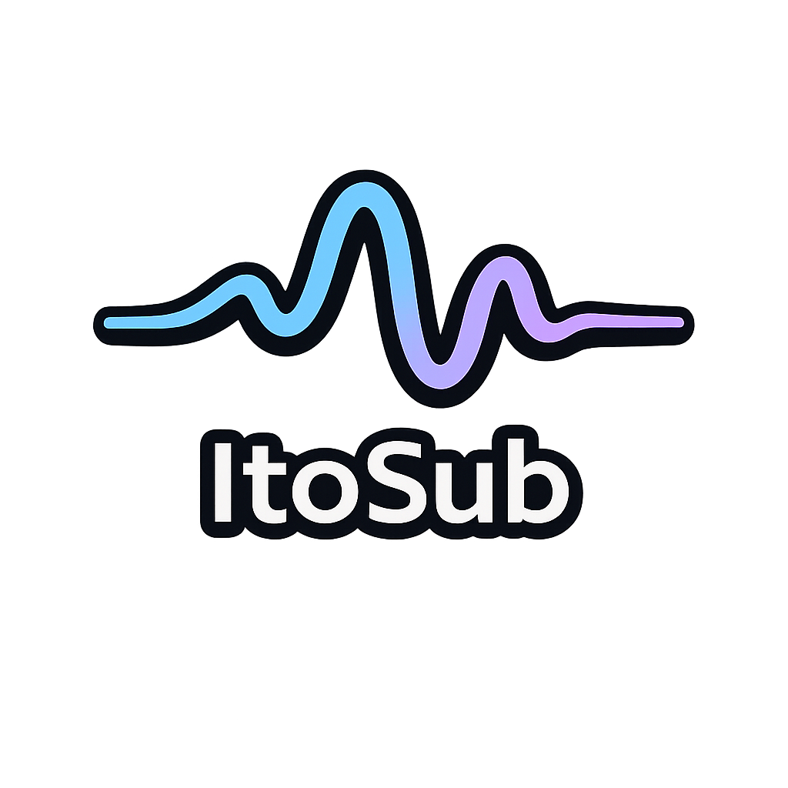

# ItoSub


Real-time speech subtitle overlay app for Windows, built with Python and PyQt6.

ItoSub captures microphone input, detects speech, transcribes finalized utterances with Whisper (faster-whisper), translates to Japanese with Argos, and renders live subtitles in an always-on-top overlay.

## Features

- Live microphone capture with utterance-based finalization (not per-chunk decode).
- Real-time subtitle overlay (frameless, translucent, always-on-top).
- English and Japanese stacked subtitle display.
- Async translation mode (EN appears first, JA follows).
- Settings UI with runtime-applied configuration.
- System tray controls (Start/Stop, Pause/Resume, Show/Hide Overlay, Settings, Open Logs, Quit).
- User-editable overlay hotkeys.
- Presets and custom preset save/load.
- Mic test and mic test+playback tooling.

## Current Status

Milestones 4-6 are complete; Milestone 7 is in progress with app runtime, tray, settings, and diagnostics baseline implemented.

## High-Level Architecture

The app uses a split architecture to keep UI responsive:

1. UI thread (PyQt):
- Main window, settings dialog, overlay widget.
- Polls a subtitle queue with `QTimer`.
- Applies subtitle updates and UI state changes.

2. Worker thread:
- Runs mic -> VAD -> utterance finalization -> ASR -> translation pipeline.
- Pushes subtitle lines and readiness/error signals through queues.

3. Config/logging layer:
- Defaults from `assets/config/default.json`.
- User config from `%APPDATA%/ItoSub/config.json`.
- CLI flags override both.
- App logs under `%APPDATA%/ItoSub/logs`.

### Core modules

- App entry/runtime:
  - `itosub/app/main.py`
  - `itosub/app/runtime.py`
  - `itosub/app/services.py`
  - `itosub/app/config.py`
  - `itosub/app/settings_qt.py`
  - `itosub/app/main_window_qt.py`
  - `itosub/app/diagnostics.py`
- UI/overlay:
  - `itosub/ui/overlay_qt.py`
  - `itosub/ui/bridge.py`
- Audio/VAD:
  - `itosub/audio/mic.py`
  - `itosub/audio/vad.py`
  - `itosub/audio/vad_webrtc.py`
  - `itosub/audio/utterance_chunker.py`
- ASR:
  - `itosub/asr/faster_whisper_pcm16.py`
  - `itosub/asr/faster_whisper_stream.py`
- Translation/NLP:
  - `itosub/nlp/translator/argos.py`
  - `itosub/nlp/translator/factory.py`
  - `itosub/nlp/segmenter.py`
  - `itosub/nlp/postprocess_en.py`
- Contracts:
  - `itosub/contracts.py`

## Requirements

## OS

- Windows 10/11 (primary target).

## Python

- Python 3.10+ (`3.13` is currently used in this repo).

## System dependencies

- Microsoft Visual C++ Redistributable (x64, 2015-2022) is recommended for runtime stack stability.

## Python dependencies

`pyproject.toml` currently contains minimal packaging deps; full runtime uses additional libs imported by app modules.

Typical runtime stack includes:
- `PyQt6`
- `sounddevice`
- `numpy`
- `faster-whisper` (+ `ctranslate2`)
- `torch` (runtime preload path handled in app startup)
- `argostranslate`
- `platformdirs`
- optional: `webrtcvad` / `webrtcvad-wheels` for WebRTC VAD demos

## Installation

```powershell
python -m venv .venv
.\.venv\Scripts\Activate.ps1
python -m pip install -U pip
python -m pip install -e .
python -m pip install PyQt6 sounddevice numpy faster-whisper argostranslate torch
```

Optional (VAD demos):

```powershell
python -m pip install webrtcvad-wheels
```

If needed for older `webrtcvad` flows:

```powershell
python -m pip install --force-reinstall "setuptools<81"
```

## Running the App

## Main app

```powershell
python -m itosub.app.main
```

## Preferred quality profile (current tuned baseline)

```powershell
python -m itosub.app.main --device 1 --sr 48000 --model base --translator argos --async-translate --silence-chunks 1 --gap-sec 0.8 --hard-max-chars 120 --poll-ms 30 --max-updates-per-tick 50
```

Optional if short phrases are missed:

```powershell
python -m itosub.app.main --device 1 --sr 48000 --model base --translator argos --async-translate --silence-chunks 1 --gap-sec 0.8 --hard-max-chars 120 --poll-ms 30 --max-updates-per-tick 50 --min-utter-sec 0.3
```

## Useful CLI options

- `--list-devices`: print audio devices and exit.
- `--device`: sounddevice input device id.
- `--ui-language`: `en|ja`.
- `--language-lock`: `auto|en`.
- `--translator`: `argos` (product default).
- `--overlay-position`: `bottom_center|bottom_left|top_center|custom`.
- `--overlay-opacity`: `0..100`.

## Configuration

Precedence:

1. `assets/config/default.json`
2. user config `%APPDATA%/ItoSub/config.json`
3. CLI flags (highest priority)

Notable keys:

- Audio: `device`, `sr`, `channels`, `chunk_sec`, `rms_th`
- ASR: `model`, `language_lock`
- Translation: `translator`, `async_translate`
- Overlay: `show_en`, `max_lines`, font sizes, hotkeys, `overlay_opacity`, `overlay_position`, `overlay_text_selectable`
- UI: `ui_language`
- Queue/UI cadence: `poll_ms`, `queue_maxsize`, `max_updates_per_tick`
- Presets: `active_preset`, `custom_presets`

## Overlay and Hotkeys

Default hotkeys:

- `H`: toggle EN line
- `+ / -`: font size up/down
- `P`: pause/resume
- `T`: toggle text selectable
- `Esc`: return focus to main window (does not quit)

All hotkeys are editable in Settings.

## Testing

Run full test suite:

```powershell
pytest -q
```

Current suite covers:
- config resolution and args
- runtime/service wiring
- diagnostics/logging behavior
- overlay formatting and bridge behavior
- live pipeline and translator stubs

## Demos

Examples:

```powershell
python -m itosub.demos.demo_overlay_smoke
python -m itosub.demos.demo_live_overlay_translate --config itosub/live_mic.json --translator argos
python -m itosub.demos.demo_live_mic_translate_vad --device 1 --sr 48000 --channels 1 --chunk-sec 0.5 --model base --translator argos --vad 1 --frame-ms 20 --min-speech-ms 260 --end-silence-ms 750 --gap-sec 0.9 --hard-max-chars 140
```

## Logging and Diagnostics

- Logs are written to `%APPDATA%/ItoSub/logs`.
- UI error popups include cause, hint, and log path.
- Runtime preloads ASR stack before PyQt initialization to reduce Windows DLL init failures.

## Packaging (Windows, PyInstaller)

Spec file:

- `ItoSub.spec`

Icon assets:

- `assets/image/ItoSubIcon.png` (runtime window/tray usage)
- `assets/image/ItoSubIcon.ico` (EXE embedded icon)

Build command:

```powershell
.\.venv\Scripts\pyinstaller --noconfirm --clean ItoSub.spec
```

Output:

- `dist/ItoSub/ItoSub.exe`

If taskbar icon appears stale after rebuild, unpin old shortcut and pin the newly launched executable again.

## Troubleshooting

## ASR runtime init failure (torch/ctranslate2/faster-whisper)

- Repair/install Microsoft Visual C++ Redistributable x64 (2015-2022), reboot, retry.

## Config JSON decode error with BOM

- Config loader accepts UTF-8 with/without BOM (`utf-8-sig`); keep config as valid JSON object.

## Slow first run

- First run includes model/translator warmup.
- Evaluate responsiveness from second run onward.

## Argos warnings

- Some Argos `mwt` warnings are informational/non-fatal.

## Contributing Notes

- Keep heavy ASR/translation work off UI thread.
- Preserve utterance-finalization approach (no per-chunk faster-whisper decode).
- Keep contracts in `itosub/contracts.py` stable (`ASRSegment` uses `t0`/`t1`).
- Avoid breaking existing demos/tests (`pytest -q` before PR/merge).


